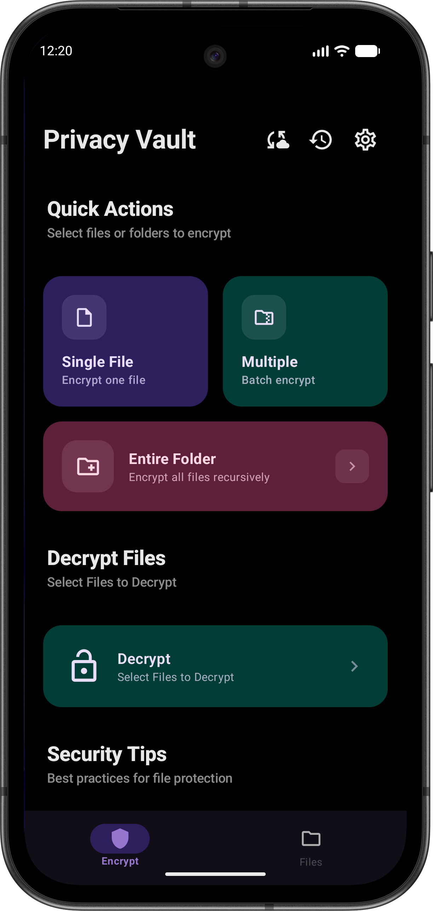
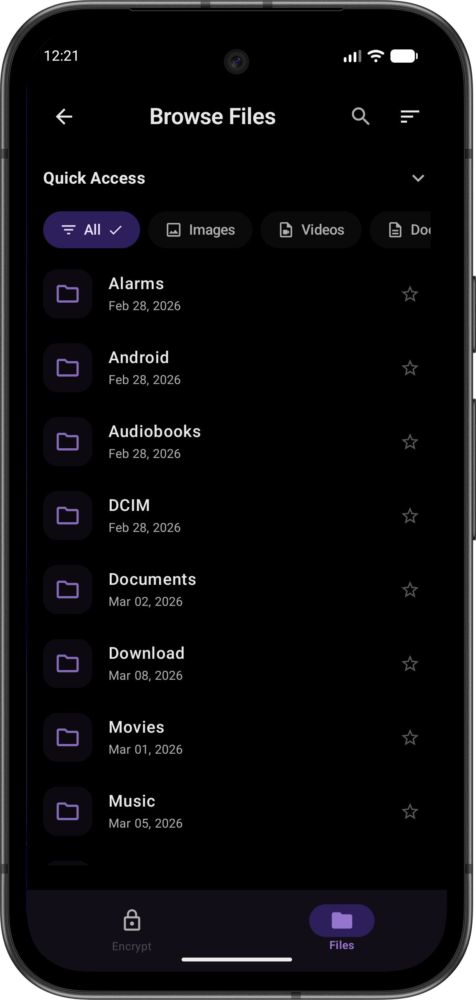
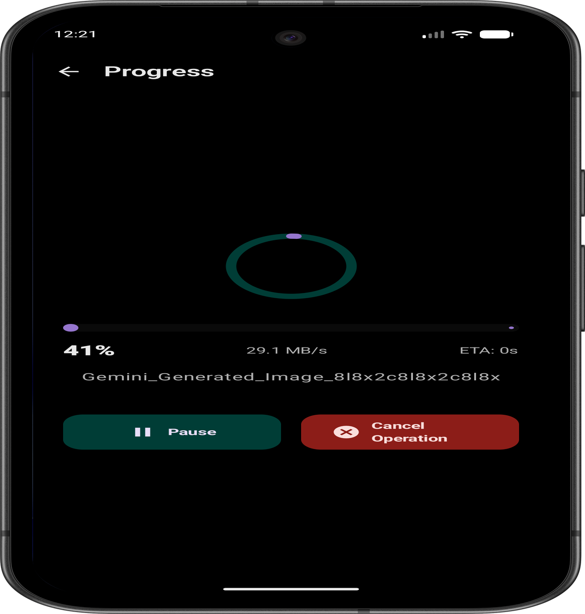
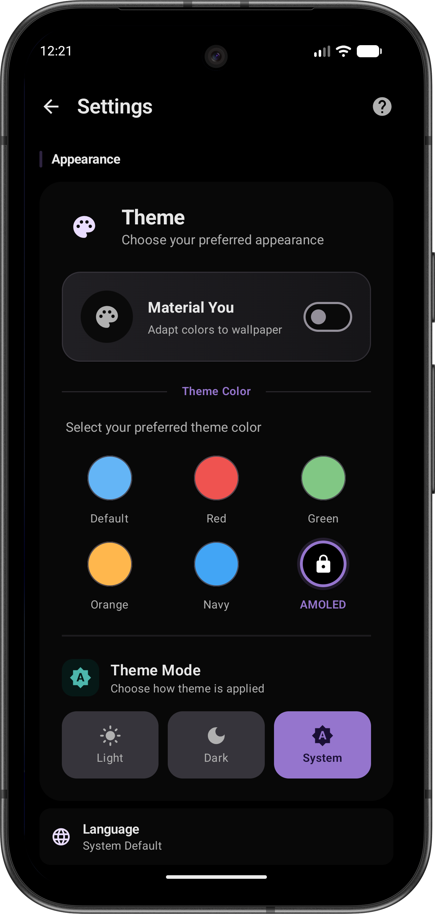
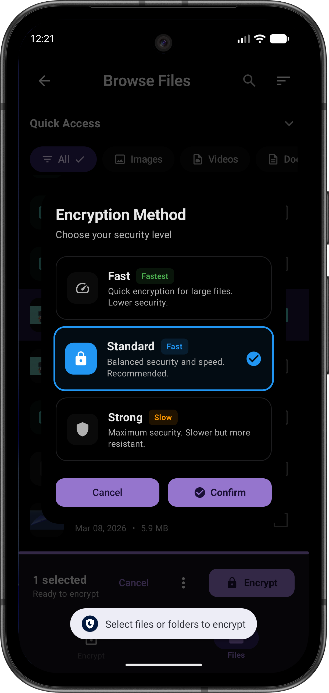

# Obfs Encrypt

🔐 Military-grade file encryption for Android. AES-256-GCM with Argon2id, biometric unlock, and background batch processing. 100% offline.

[](LICENSE)
[](https://developer.android.com)
[](https://kotlinlang.org)

---

## 📸 Screenshots

<div align="center">

| Home Screen | Encryption | Decrypt | Settings | History |
|:-----------:|:----------:|:-------:|:--------:|:-------:|
|  |  |  |  |  |
| *Quick Actions* | *Choose Security Level* | *Decrypt with ease* | *Customize App* | *Track Operations* |

</div>

---

## ✨ Features

- **🔒 Unbreakable Encryption**: AES-256-GCM with Argon2id key derivation
- **👆 Biometric Unlock**: Quick access with fingerprint or face recognition
- **🚀 Background Processing**: Encrypt large files without blocking your device
- **🎨 Modern UI**: Beautiful Material Design 3 interface
- **🌙 Theme Support**: Light, Dark, and Material You dynamic colors
- **📁 Batch Operations**: Encrypt multiple files or entire folders at once
- **🔐 App Lock**: Protect the app itself with authentication
- **💾 Secure Delete**: Overwrite originals with random data before deletion

---

## 🏗️ Architecture

Built with modern Android best practices:

- **Kotlin** with Coroutines and Flow
- **Jetpack Compose** for modern declarative UI
- **Hilt** for dependency injection
- **MVVM** architecture with Clean Architecture principles
- **WorkManager** for reliable background processing
- **Android Keystore** for secure key storage

---

## 🔐 Security

- **AES-256-GCM**: Industry-standard authenticated encryption
- **Argon2id**: Memory-hard key derivation (resistant to GPU/ASIC attacks)
- **Biometric Authentication**: Fingerprint/Face unlock
- **Secure Key Storage**: Hardware-backed Android Keystore
- **Secure Delete**: DoD 5220.22-M style data overwriting
- **100% Offline**: No network permissions, all processing local

---

## 🚀 Getting Started

### Prerequisites

- Android 8.0 (API 26) or higher
- Kotlin knowledge for development

### Build

```bash
./gradlew assembleDebug
```

### Install

```bash
adb install app/build/outputs/apk/debug/app-debug.apk
```

---

## 📁 Project Structure

```
obfesc/
├── app/src/main/java/com/obfs/encrypt/
│   ├── crypto/          # Encryption core (AES-256-GCM, Argon2id)
│   ├── data/            # Data layer (Room database, repositories)
│   ├── di/              # Dependency injection (Hilt modules)
│   ├── security/        # Security features (biometrics, app lock)
│   ├── services/        # Background services (WorkManager)
│   ├── ui/              # UI layer (Compose screens)
│   └── viewmodel/       # ViewModels
├── docs/
│   └── screenshots/     # App screenshots
└── gradle/              # Build configuration
```

---

## 🤝 Contributing

Contributions are welcome! Please read the [CONTRIBUTING.md](CONTRIBUTING.md) guidelines.

---

## 📄 License

Licensed under the Apache License 2.0. See [LICENSE](LICENSE) for details.

---

## ⚠️ Security

For security vulnerabilities, please see [SECURITY.md](SECURITY.md).

---

<div align="center">

**Your files deserve military-grade protection.**

</div>
